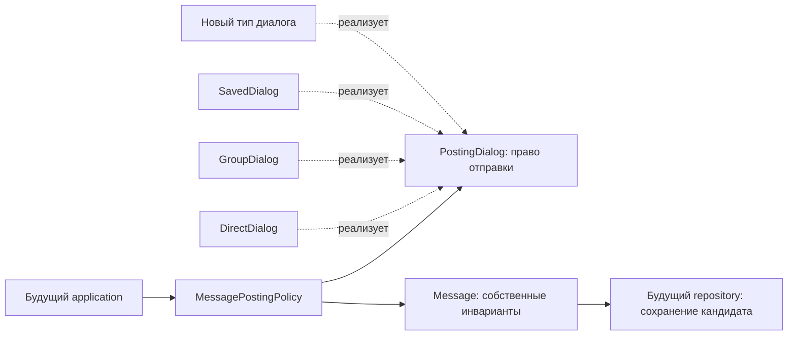

# Домен Messages and Dialogues: walkthrough изменений

Дата: 29 сентября 2026 года. Область: домен, его тесты и документация сервиса.

`Message` больше не зависит от видов диалога. Личные диалоги, «Избранное» и группы
используют одну модель сообщения. Группы поддерживают до 1000 участников, всю
историю для текущих участников и смену аватара через ссылку на внешний объект.
Закрыты обнаруженные обходы валидации и проверки доступа при receipts.

Это завершённая доработка доменного слоя для согласованных правил. Business API,
application-сценарии и адаптеры хранения пока не реализованы. Рабочий чат через
сеть и защиту от распределённых гонок эти изменения сами по себе не обеспечивают.

## 1. Карта изменений

| Было | Стало | Практический результат |
|---|---|---|
| Message знал Direct/Group/Saved, вид диалога и получателя | Message хранит только собственные данные; проверку отправки выполняет MessagePostingPolicy | Новый тип диалога не меняет модель сообщения |
| Тип сообщения выводился из сырого входного словаря | Единая форма без вывода типа | Нет противоречивых комбинаций type/recipient или изменения входного словаря |
| Правила receipts зависели от конкретных классов | Узкий ReceiptDialog и проверка текущего доступа | Нельзя использовать чужой или устаревший watermark как разрешение |
| Avatar отсутствовал, размер группы не ограничивался | ObjectId аватара и MAX_GROUP_MEMBERS = 1000 | Создание, восстановление и изменения проверяют одинаковые ограничения |
| Вложения были UUID без отдельного доменного имени | ObjectId, сериализуемый в прежний UUID | Явная внешняя идентичность без S3/URL/метаданных в Message |
| Стандартные Pydantic copy/construct обходили проверки | Проверенные overrides и повторная валидация вложенных экземпляров | Невалидное содержимое не проходит через обычные пути создания снимка |
| Изменяемые frozen-модели могли иметь меняющийся hash | MutableEntity и подклассы не хешируются | Изменение агрегата не повреждает ключи dict/set |
| Числовые позиции и версии допускали преобразование типов | Строгие положительные int | True, 1.0 и строка «1» не принимаются как позиция/версия |

## 2. Message: что именно ему принадлежит

Начать чтение стоит с [message.py](../src/app/domain/aggregates/message.py).
У модели семь полей, включая унаследованные id и created_at:

| Поле | Назначение |
|---|---|
| id | Идентичность сообщения |
| dialog_id | Ссылка на диалог |
| sender_id | Автор |
| client_message_id | UUIDv7 логической клиентской отправки |
| content | Валидированный текст и упорядоченные ссылки на вложения |
| position | Позиция именно в этом диалоге |
| created_at | Серверное время создания, timezone-aware UTC |

У сообщения нет `recipient_id`, `dialog_kind`, изменяемого `status` и списка
участников. Получатель определяется при конкретной операции: у группы их
несколько, у «Избранного» отдельного второго получателя нет.

Собственные инварианты проверяются при фабрике, конструкторе и восстановлении:

- Позиция принадлежит `dialog_id` сообщения.
- Содержимое непустое: текст и/или вложения.
- Текст нормализуется в NFC и LF, обрезается по краям, ограничен 4096 символами.
- Вложений не больше четырёх, их порядок сохраняется, одинаковые ObjectId запрещены.
- Время имеет часовой пояс и приводится к UTC.
- Клиентский идентификатор имеет требуемую версию UUID.
- Неизвестные поля, включая прежние поля типа и получателя, отклоняются.

Поведение самой модели: `create`, `is_sent_by`, `send_key`, `text_value`.
`send_key` остаётся парой `(sender_id, client_message_id)`: повтор отправки в
другой диалог не должен незаметно создавать новое логическое действие.
Сравнение intent и устранение дублей должен реализовать будущий application.

`Message.create` создаёт **кандидата**. Сам факт существования Python-объекта не
подтверждает права автора, существование диалога или успешную запись в БД.
Гидратация также проверяет структуру снимка, а не историческую авторизацию автора.

## 3. Отправка и расширение типов диалогов

[MessagePostingPolicy](../src/app/domain/policies/message_posting.py) получает
[PostingDialog](../src/app/domain/protocols.py), которому достаточно предоставить
`id`, `created_at` и `require_can_send(user_id)`.

Политика последовательно проверяет право отправки и время относительно создания
диалога, затем создаёт Message. В ней нет switch/if по типу диалога.



Типичный вызов после загрузки диалога и получения позиции:

```python
message = MessagePostingPolicy.create_message(
    dialog=dialog,
    sender_id=actor_id,
    client_message_id=client_message_id,
    content=MessageContent.from_parts(text=text, attachments=object_ids),
    position=position,
    now=now,
)
```

Новый тип должен реализовать правила своего диалога. Если ему нужны receipts,
он также предоставляет интерфейс ReceiptDialog. Тест
[test_dialog_extension.py](../tests/unit/domain/messages/test_dialog_extension.py)
добавляет независимый AnnouncementDialog: писать может издатель, читать —
подписчики. Отправка, восстановление Message, ACK и статус работают с ним без
добавления production-веток.

Это и есть применённый OCP для оси «новые типы диалогов». OCP не означает запрет
любых будущих изменений Message: редактирование сообщений или новая семантика
содержимого могут законно менять его собственный контракт.

## 4. Личный чат, «Избранное» и группа

| Правило | DirectDialog | SavedDialog | GroupDialog |
|---|---|---|---|
| Участники | Два разных пользователя | Один владелец | От 1 до 1000, включая владельца |
| Отправка и история | Участники пары | Владелец | Текущие участники |
| История до вступления | Состав неизменен | Состав неизменен | Полностью доступна |
| Смена названия и аватара | Не моделируется | Не моделируется | Любой текущий участник |
| Изменение состава | Не моделируется | Не моделируется | Любой текущий участник |
| Передача владения | Не применяется | Не применяется | Только владелец, существующему участнику |
| Удаление владельца | Не применяется | Не применяется | Запрещено до передачи владения |
| ACK своих сообщений | Запрещён | ACK отсутствуют | Запрещён |

`DirectParticipants` сохраняет каноническую пару: A–B и B–A равны. A–A в
DirectDialog запрещён; для сообщений себе используется SavedDialog.
Один личный диалог на пару и одно «Избранное» на владельца — будущие ограничения
репозитория. Фабрика в памяти не может обеспечить их при конкуренции.

В [GroupDialog](../src/app/domain/aggregates/group_dialog.py) сохранены
`add_member`, `remove_member`, `rename`, `change_owner`. Добавлены
`avatar_object_id`, `change_avatar`, `remove_avatar`, общий контракт доступа
и ограничение состава. Лимит расположен в [limits.py](../src/app/domain/limits.py).

Владелец автоматически включается при создании. Добавление 1001-го пользователя
отклоняется без изменения состава, версии и времени. Невалидное восстановление
такой группы также отклоняется. Повторная установка того же аватара и удаление
уже отсутствующего аватара возвращают False, сохраняя версию и updated_at.

После исключения или самостоятельного выхода участник больше не может читать,
отправлять или подтверждать сообщения. При этом сообщения ушедшего автора
остаются историей: проверять его текущее членство при чтении было бы ошибкой.
Это проверяется в [test_group_history.py](../tests/unit/domain/groups/test_group_history.py).

При повторном вступлении снова доступна вся история — следствие выбранного
правила текущего состава. История отдельных периодов членства пока не моделируется.

## 5. ReceiptWatermark и статус

[ReceiptWatermark](../src/app/domain/aggregates/receipt_watermark.py) хранит две
границы для `(dialog_id, user_id)`: доставлено и прочитано. Собственные сообщения
не входят в подтверждаемую последовательность входящих.

ACK требует одновременно:

1. actor_id совпадает с владельцем watermark.
2. Watermark, диалог и through-message относятся к одному диалогу.
3. Читателю сейчас доступно сообщение по правилам диалога.
4. Диалог поддерживает подтверждения, а сообщение имеет другого автора.

Доступ проверяется **до** обработки повторного ACK как no-op. Поэтому старый
receipt исключённого участника не позволяет продолжить работу с группой.
Новый участник вправе подтвердить старую историю, даже если её автор уже вышел.

READ продвигает обе границы так, чтобы `read <= delivered`; DELIVERED не откатывает
READ. Запоздалый ACK не уменьшает границы, не меняет версию и время. Конфликт
двух message IDs на одной позиции отклоняется.

[MessageDeliveryPolicy](../src/app/domain/policies/message_delivery.py) теперь
вызывается с `dialog` и явным `recipient_id`:

```python
status = MessageDeliveryPolicy.calculate_status(
    message,
    watermark,
    dialog=dialog,
    recipient_id=reader_id,
)
```

Получатель обязан иметь доступ, а watermark — принадлежать ему. Сначала
проверяется READ, затем DELIVERED, иначе возвращается SENT. Для «Избранного»
возвращается SENT; модель не имитирует подтверждение вторым участником.

Предусловие этой политики: передан уже сохранённый Message. Python-политика
не может проверить durable запись и не должна обращаться за этим в БД.
Права пользователя, запрашивающего отображение чужого статуса, application
проверяет отдельно от права рассматриваемого получателя читать сообщение.

## 6. Изображения и ObjectId

Решение: [ObjectId](../src/app/domain/value_objects/object_id.py) оборачивает
UUID, выданный Object Storage. Он используется для вложений MessageContent
и аватара группы. Сервис Messages не генерирует внешний object ID и не хранит
байты изображения, bucket, физический S3 key, MIME, размер, checksum или URL.

Непрозрачность — правило использования идентификатора: Messages сравнивает
и передаёт его, не извлекает из него путь, владельца или назначение.
UUID — выбранный формат контракта, а не требование S3. Иная стабильная opaque
строка также возможна, но потребует отдельного изменения согласованных контрактов.

Обоснование исследования:

- S3 key определяет объект внутри конкретного bucket; путь и префиксы являются
  частью физического имени. Отдельный object ID оставляет это решение внутри
  Object Storage. [AWS: object keys](https://docs.aws.amazon.com/AmazonS3/latest/userguide/object-keys.html).
- Presigned URL предоставляет временный доступ, а повторная загрузка по тому же
  ключу может заменить объект. Поэтому URL не подходит для постоянной ссылки
  сообщения. [AWS: presigned URLs](https://docs.aws.amazon.com/AmazonS3/latest/userguide/using-presigned-url.html).
- Разделение постоянной идентичности и имени доставки применяется, например,
  в Cloudinary: asset ID остаётся неизменным при смене public ID.
  [Cloudinary: identification](https://cloudinary.com/documentation/upload_parameters#identification).

Выбор UUID и неизменяемого READY-содержимого — проектное решение для Andruha,
выведенное из этих свойств; это не универсальное требование перечисленных систем.

Будущий application должен проверять ready, право использования и purpose.
Для аватара дополнительно требуется изображение. После принятия ID должен
обозначать то же содержимое: новая версия файла получает новый ObjectId.
Удаление аватара снимает только ссылку; удаление самого файла и удержание
используемых объектов требуют отдельного протокола Object Storage.

В доменном снимке коллекция вложений по-прежнему сериализуется в UUID, а в JSON
в UUID-строки. Общая `message.v1` schema требует метаданные вложений: её следует
согласовать на этапе transport DTO/проекций. В этой работе общий контракт и
Object Storage не изменялись.

## 7. Защита инвариантов

В [base.py](../src/app/domain/base.py) сохранён существующий механизм:
сначала полностью валидируется кандидат, затем бизнес-поля, updated_at и version
применяются вместе. Ошибка оставляет исходный агрегат нетронутым.

Дополнительно:

- `revalidate_instances="always"` перепроверяет вложенные модели, включая экземпляры,
  полученные через небезопасный внешний Pydantic copy.
- `model_copy(update=...)` создаёт проверенный снимок; `deep=True` поддерживается.
- `model_construct` также валидирует: в домене больше нет штатного unchecked пути.
- Изменяемые агрегаты не хешируются; идентификатор агрегата остаётся подходящим
  ключом для словаря.
- Версия и позиция принимают только положительный int.

Проверенная копия не является командой изменения агрегата: она не проверяет
actor_id и не исполняет протокол сохранения. Для изменения используются только
доменные методы. Эти гарантии рассчитаны на публичные API моделей, не на
намеренный обход через reflection или запись в приватное состояние Python.

## 8. SOLID и сохранённые преимущества

| Принцип | Реализация и граница гарантии |
|---|---|
| SRP | Message отвечает за сообщение; диалог — за доступ и состав; posting policy — за совместную проверку перед отправкой; delivery policy — за вывод статуса |
| OCP | Добавление типа диалога с теми же возможностями требует реализации протоколов, не изменений Message или веток по enum |
| LSP | Каждый диалог предоставляет одинаковый контракт разрешения/отказа; наличие receipts объявляется явно, SavedDialog не притворяется обычным двухсторонним чатом |
| ISP | PostingDialog и ReceiptDialog содержат только нужные соответствующему потребителю операции; управление группой не попадает в общий интерфейс |
| DIP | Политики зависят от доменных протоколов; домен не импортирует application, persistence, HTTP или Object Storage client |

Pydantic остаётся согласованной библиотекой валидации. Полной независимости от
любых библиотек здесь нет; зависимости от транспорта и хранилища отсутствуют.
SOLID проверяется по этим конкретным границам, а не заявлением об «идеальном» коде.

Сохранены сильные стороны исходной модели: небольшие агрегаты, неизменяемые
сообщения и value objects, отдельные позиции и checkpoints, каноническая пара
личного диалога, sender-scoped send key, атомарные изменения и монотонные receipts.
История не загружается внутрь агрегата диалога; сообщение остаётся отдельной
единицей хранения. Групповой состав ограничен 1000 элементами, поэтому стоимость
проверки и копирования снимка имеет явную верхнюю границу.

## 9. Изменения внутреннего API

| Прежнее использование | Новое использование |
|---|---|
| Message.for_direct / for_group / for_saved | MessagePostingPolicy.create_message(dialog=..., ...) |
| Поля Message.dialog_kind и Message.recipient_id | Правила загруженного диалога; получатель передаётся в операцию статуса |
| message.is_direct / is_group / is_saved | Решение принадлежит сценарию/диалогу, Message не классифицируется |
| message.delivery_status(...) | MessageDeliveryPolicy.calculate_status(..., dialog=..., recipient_id=...) |
| content.attachments как tuple UUID | tuple ObjectId; UUID доступен через reference.value |
| Непроверенный model_construct/model_copy | Проверенный снимок; для команд — бизнес-методы |

Удалены неиспользуемый DialogKind и SenderRecipientSameUserError. Собственные
сообщения являются нормальным случаем SavedDialog; ограничения ACK выражаются
через NotIncomingMessageError. Существующие тесты переведены на новую границу,
проверки прав, времени, содержимого и позиций сохранены.

Если появятся ранее сохранённые снимки старого Message, mapper должен явно
преобразовать их в новую форму. Молчаливого распознавания старого типа нет.
Действующего persistence adapter и миграций данных в этом сервисе пока нет.

## 10. Что проверено

Проверки выполнены локально под Python 3.14 через имеющееся uv-окружение
(`uv run --no-sync --offline`). Перед коммитами отдельно проверены их снимки:
223 unit-теста для защиты моделей, 234 после добавления правил группы и 298
для итогового кода. Последний прогон исключает несвязанные локальные изменения
настроек и HTTP middleware; результаты ниже относятся к содержимому PR.

| Проверка | Результат |
|---|---|
| pytest tests/unit -q -x с branch coverage | 298 passed |
| pytest tests/integration -q -x с добавлением coverage | 8 passed |
| Совокупное покрытие с учётом ветвлений | 99,57%, порог 80% выполнен |
| ruff check src tests | Passed |
| ruff format --check src tests | Passed, 90 Python-файлов |
| ty check --error-on-warning | Passed |
| Read-only prek hooks | Passed для применимых hooks по существующим файлам, включая новые; модифицирующая группа fix исключена |
| git diff --check | Passed |
| Локальные ссылки и Markdown fences в обновлённых документах | Passed |

В integration есть одно DeprecationWarning из `starlette.testclient`:
используется устаревший alias `anyio.abc.BlockingPortal`. Это предупреждение
зависимости; исходники и lock-файл ради него не менялись.

Новые регрессии расположены в `tests/unit/domain/messages`, `groups`, `media`,
`receipts`, `validation`: независимый тип диалога, стабильная форма Message,
1000/1001 участников, история до вступления, уход автора, прекращение доступа,
аватар, внешние ссылки, copy/construct, nested revalidation и hash.

Интеграционные тесты проверяют HTTP bootstrap, lifespan и request ID. Они не
подтверждают работу переписки с реальными Cassandra, Kafka, Identity или
Object Storage. Такие адаптеры отсутствуют. Docker smoke, внешняя проверка
уязвимостей зависимостей и удалённый CI в рамках этой работы не запускались.

## 11. Следующие границы реализации

1. **Application создания диалогов.** Проверять завершённую регистрацию через
   Identity; получать один канонический DirectDialog на пару и SavedDialog на
   владельца; доводить обязательные пользовательские проекции.
2. **Согласованность групп.** Связать версию состава и принятие команд так,
   чтобы исключённый участник не мог успешно записать сообщение/ACK по старому
   снимку. Выбрать сериализацию команд или протокол условных записей и проверить
   конкурентные изменения, включая двух кандидатов на последнее свободное место.
3. **Принятие сообщений.** Реализовать durable send key, сравнение intent,
   канонический порядок и восстановление частичных эффектов. Подтвердить правила
   для restart, неизвестного исхода записи и повторов после смены временного bucket.
4. **Object Storage.** Согласовать стабильный ObjectId, жизненный цикл READY,
   неизменяемость содержимого и разрешение использования. Затем подключить
   проверку вложений/аватара и согласовать transport DTO.
5. **Receipts и публикация.** Реализовать OCC-запись watermark и восстановление
   событий после crash. Доменный no-op не доказывает, что предыдущая публикация
   уже завершилась. Правило текущего доступа применяется также к чтению истории.

Перечисленное — работа следующих слоёв, не скрытые гарантии текущего домена.
Работа оформляется в ветке `feat/domain-layer` четырьмя последовательными
коммитами: защита моделей, правила групп, сообщения и receipts, документация.
Существующие изменения настроек и HTTP middleware сохранены вне этих коммитов.
