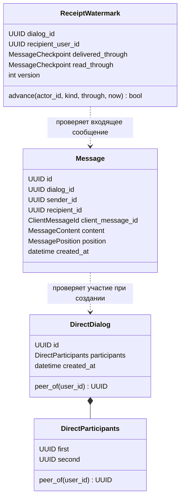

# Доменная модель Messages and Dialogues

Дата проекта: 18 сентября 2026 года. Первый доменный инкремент реализован
19 сентября; последующие модели остаются проектом.
[Walkthrough первой итерации и результаты проверок](domain-iteration-1-walkthrough-2026-09-19.md).

Предлагаются три независимых агрегата: `DirectDialog`, `Message` и
`ReceiptWatermark`. Первый доменный инкремент содержит только личный диалог и
пару участников. Остальные модели описаны, чтобы проверить границы заранее;
их код добавляется вместе с соответствующим продуктовым этапом.

## 1. Основания и границы работы

Приоритет для последовательности работ —
[план от 18 сентября](../../../docs/product-development-plan-2026-09-18.md).
Для Kafka wire-format — фактические JSON Schema в корневом `contracts/`.
[Handbook Messages](../../../docs/developer-handbook/03-messages-dialogues-cassandra.md)
используется с поправками из раздела 10 этого проекта.

Исходная база проекта от 18 сентября:

- Messages `28fdfcb`: operational skeleton, доменная реализация отсутствует.
- User Profile `dc3f520`: агрегаты, value objects, policies, доменные ошибки,
  application ports и тесты защищённых изменений.
- Identity `b1f070b`: среди подключённых HTTP routes нет внутренней проверки
  завершённой регистрации произвольного собеседника.

Проект дополняет [словарь](../CONTEXT.md). Первая итерация исходников реализует
раздел 4; межсервисные schemas остаются прежними.

Состав MVP: диалоги 1:1, неизменяемые сообщения, delivery/read watermarks.
Группы, роли администратора диалога, выход участника, edit/delete сообщений,
реакции, блокировки собеседников и архивирование сейчас не моделируются.

## 2. Что берём из User Profile Service

| Проверенный образец | Применение в Messages |
|---|---|
| [DomainModel и базовые сущности](../../user-profile-service/src/app/domain/base.py) | Pydantic v2 допустим как библиотека построения и проверки доменных объектов; HTTP и persistence DTO остаются отдельными |
| [UserProfile](../../user-profile-service/src/app/domain/aggregates/profiles.py) | Именованные фабрики и методы предметной области, защищённая идентичность |
| [Username](../../user-profile-service/src/app/domain/value_objects/username.py), [PrivacySettings](../../user-profile-service/src/app/domain/value_objects/privacy.py) | Неизменяемые, самовалидирующиеся value objects |
| [Тесты атомарных изменений](../../user-profile-service/tests/unit/domain/test_atomic_mutations.py) | Ошибка не меняет исходный агрегат; no-op не увеличивает версию |
| [Application ports](../../user-profile-service/src/app/application/ports/README.md) | Порты принадлежат application; репозитории и readers имеют разные задачи |
| [Публичный фасад domain](../../user-profile-service/src/app/domain/__init__.py) | Небольшие явные экспорты через `__all__` |

Базовые классы локальны этому сервису: runtime-импорта из Profile и общего
межсервисного пакета моделей не требуется. При реализации Pydantic объявляется
прямой зависимостью, даже если уже доступен транзитивно через FastAPI.

`DirectDialog` и `Message` неизменяемы в MVP: им достаточно идентичности,
времени создания и проверенного содержимого. `version` и `updated_at` появляются
у изменяемого `ReceiptWatermark`; его естественный ключ составной, поэтому
случайный дополнительный `id` ему не нужен.

Все вложенные значения также неизменяемы. Для коллекций используются tuple,
а не изменяемые list/set. Конструирование и восстановление проверяют одинаковые
локальные инварианты; `model_construct` и непроверенный `model_copy(update=...)`
не являются путями восстановления или изменения. Фабрики получают ID и время
явно: повторная гидратация не создаёт новую идентичность.

Домен не содержит JSON aliases, HTTP-кодов, Kafka envelopes, SDK типов,
SQL/CQL-моделей, настроек `app.core`, логирования пользовательского содержимого
или сетевых вызовов. `snake_case` домена переводится в wire-format в адаптерах.

## 3. Bounded context и агрегаты

Messages владеет правдой о составе диалога, принятом сообщении и подтверждениях
получателя. Identity владеет учётной записью, Profile — её публичным
представлением, Object Storage — готовностью и метаданными объекта.
Связи с ними представлены идентификаторами и согласованными фактами через порты.



Пунктир обозначает использование фактов другого агрегата. Агрегаты хранят ссылки
по ID; они не включают друг друга в собственное изменяемое состояние.

В `DirectDialog` нет списка всех сообщений. Добавление сообщения не меняет
диалог. Это даёт ограниченный размер агрегата и независимые записи сообщений.
В MVP такой разрыв безопасен благодаря неизменности пары участников. Добавление
выхода из диалога или блокировок потребует отдельного решения о согласованности
между изменением доступа и принятием сообщения.

`DialogSummary`, история, preview, unread count, sync event и activity pointer —
read models или технические проекции. Они не становятся агрегатами только
потому, что для них существует таблица. Cassandra проектирует таблицы под запросы
и допускает представление одной сущности в нескольких таблицах:
[официальное описание data modeling](https://cassandra.apache.org/doc/latest/cassandra/developing/data-modeling/intro.html).

## 4. Первый инкремент: личный диалог

### DirectParticipants — value object

Состояние: `first: UUID`, `second: UUID`.

Фабрика `from_user_ids(first: UUID, second: UUID)`:

1. Проверяет, что это два разных корректных UUID.
2. Упорядочивает их по `UUID.bytes`, независимо от порядка аргументов.
3. Создаёт неизменяемое значение.

Конструктор/гидратация также нормализуют порядок и запрещают одинаковые ID.
`from_user_ids(A, B) == from_user_ids(B, A)` и hash значений совпадают.
`user_id in participants` возвращает bool. `peer_of(user_id)` возвращает второго
участника, а для постороннего поднимает `NotDialogParticipantError`.

`first` и `second` обозначают только канонический порядок. Владелец,
инициатор или более привилегированный участник из него не выводятся.
Хэш `pair_key`, разделители и Cassandra partition key относятся к адаптеру.

### DirectDialog — корень агрегата

| Поле | Контракт |
|---|---|
| `id: UUID` | Стабильная идентичность диалога; новые ID генерируются сервером как UUIDv7 |
| `participants: DirectParticipants` | Ровно два разных неизменных участника |
| `created_at: datetime` | Серверное timezone-aware UTC время создания канонического диалога |

Публичный интерфейс:

```python
DirectDialog.create(
    *, dialog_id: UUID, participants: DirectParticipants, now: datetime
) -> DirectDialog

user_id in dialog -> bool
dialog.peer_of(user_id: UUID) -> UUID
```

Фабрика создаёт корректного кандидата. Доказательство глобальной уникальности
пары появляется при сохранении через порт репозитория. Восстановление возвращает
тот же ID и `created_at`, а также проверяет инварианты модели.

Идентификаторы пользователей принимаются как UUID без нового ограничения
«только v7»: текущие wire schemas пользователей такого ограничения не вводят.
UUIDv7 для новых business IDs — политика серверного генератора.

### Где обеспечивается каждый инвариант

| Инвариант | Ответственность |
|---|---|
| A отличается от B; A–B равно B–A | `DirectParticipants` |
| Только участник читает диалог/историю и отправляет сообщения | Доменная проверка участия; application обязан вызвать её перед чтением/действием |
| Оба аккаунта завершили регистрацию на момент проверки создания | Application + доверенный порт Identity |
| Во всём сервисе одна каноническая запись для пары | Семантический контракт репозитория + Cassandra LWT адаптер |
| При одновременном A→B/B→A оба получают одного победителя | Репозиторий возвращает сохранённый канонический агрегат |
| Оба пользователя видят диалог после успешного create | Application завершает обязательные проекции из канонической записи |
| Посторонний не узнаёт о существовании диалога | Entry point переводит отсутствие и запрет в одинаковый внешний ответ |

Проверка Identity не создаёт распределённую транзакцию: это подтверждённый
факт на момент проверки, а не вечная гарантия существования аккаунта.
Новые правила удаления/блокировки аккаунтов потребуют отдельной политики.

## 5. Следующий инкремент: сообщение

### Value objects

| Модель | Содержание и правила |
|---|---|
| `ClientMessageId` | Неизменяемый UUIDv7 одной клиентской отправки |
| `MessageSendKey` | `(sender_id, client_message_id)`; диалог не входит в область уникальности |
| `MessageText` | Unicode NFC; `CRLF` и `CR` преобразуются в `LF`; 1–4096 code points после нормализации |
| `MessageContent` | В текстовом инкременте содержит обязательный `MessageText`; расширение вложениями описано ниже |
| `MessagePosition` | Стабильный серверный ключ полного порядка сообщений внутри одного диалога |
| `MessageCheckpoint` | `dialog_id`, `message_id`, `position`; точная граница подтверждения |

Текст сохраняет пробелы и переносы: `.strip()` не является нормализацией
содержимого. Текущая v1 schema допускает текст из пробелов; проект сохраняет эту
семантику. Отдельный запрет визуально пустого текста потребует продуктового
решения. Пустая строка и `None` в текстовом инкременте отклоняются.

Общая будущая форма `MessageContent`: `text: MessageText | None` и
`attachments: tuple[AttachmentSnapshot, ...]`, хотя бы одна часть непустая.
Порядок вложений значим, IDs уникальны, количество 0–4. Пустая строка
при наличии вложений нормализуется в `None` до fingerprint.

`AttachmentSnapshot` содержит `object_id`, `media_type`, `size_bytes`,
`sha256: bytes` длиной 32. Для текущего wire-контракта размер — 1–26 214 400
байт, media type — 1–255 символов; SHA-256 кодируется Base64 адаптером.
Вложение не содержит S3 key, presigned URL, filename или SDK объект.
Проверку `owner + purpose + READY` выполняет application через Object Storage
до первого принятия; домен проверяет форму полученного снимка.

Классы вложений появляются на этапе медиа. Пока поддерживается только текст,
команда с непустым `attachmentIds` получает явный постоянный отказ о
неподдерживаемой возможности; вложения нельзя молча отбросить.

### Message — отдельный неизменяемый агрегат

Состояние: `id`, `dialog_id`, `sender_id`, `recipient_id`, `client_message_id`,
`content`, `position`, `created_at`.

```python
Message.create(
    *, message_id: UUID, dialog: DirectDialog, sender_id: UUID,
    client_message_id: ClientMessageId, content: MessageContent,
    position: MessagePosition, now: datetime
) -> Message
```

Фабрика проверяет участие отправителя через диалог и сама определяет получателя
через `dialog.peer_of(sender_id)`. Caller не передаёт произвольного recipient.
Время должно быть timezone-aware UTC и не предшествовать созданию диалога.
Диалог в `position` должен совпадать с диалогом сообщения; это также проверяется
при восстановлении.

Гидратация проверяет локальные свойства: разные sender/recipient, валидные
content, ID и время. Принадлежность внешнему агрегату требует загруженного
диалога на пути создания; один `model_validate` этой гарантии не даёт.

Созданный Python-объект ещё не доказывает durable принятие. Он становится
каноническим после успешной reservation. При проигранной гонке application
использует полностью сохранённого победителя, включая его ID, содержимое,
время и позицию; кандидат отбрасывается.

`message.created_at` отображается как `message.sentAt` во внешнем DTO.
`commandId`, `eventId`, `correlationId`, Kafka offset и fingerprint не являются
полями `Message`. Application хранит их в записи надёжной обработки отправки.

`Message` не имеет изменяемого поля `status`. SENT следует из durable принятия;
DELIVERED и READ вычисляются по watermark получателя.

### Идемпотентность отправки

Один `MessageSendKey` навсегда обозначает одну логическую отправку в пределах
retention сообщения. Повтор с другим диалогом или содержимым — конфликт.

Fingerprint строится application из версии семантического формата,
`dialog_id`, нормализованного текста и упорядоченных attachment IDs.
Технические IDs, время попытки, correlation/causation и изменяемые внешние
данные в него не входят. Подтверждённые метаданные вложений сохраняются в
первом каноническом снимке и повторно не запрашиваются для safe replay.

Для существующего ключа сначала сравниваются intent и сохранённый результат;
потеря доступности Object Storage не должна запрещать завершение уже принятой
отправки. Несовместимое изменение алгоритма нормализации требует совместимого
чтения прежнего формата reservation.

Техническая запись обработки хранит канонический `Message`, fingerprint,
постоянные event IDs/causation и позиции обязательных проекций. Проекции и
публикация завершаются из неё повтором. ACK команды разрешён после durable
effects и подтверждения публикации. Агрегат сам не выполняет этот протокол.

### Порядок сообщений

Семантическое требование к `MessagePosition`: сравнение задаёт строгий полный
порядок внутри диалога, сохраняется при retry и совпадает с порядком истории
и watermarks. Сравнение позиций разных диалогов запрещено.

Предлагаемое доменное представление: неизменяемые `dialog_id: UUID` и
`order_key: int > 0`; методы сравнения сначала проверяют совпадение dialog ID.
Это порядковый ключ, а не обязательно плотный счётчик. Его выдаёт application
через порт; адаптер отвечает за однозначное соответствие persisted ordering.
`MessageCheckpoint` связывает позицию с конкретными dialog/message IDs.

Handbook предлагает Cassandra `timeuuid`. Это UUIDv1, тогда как публичные
новые message IDs — UUIDv7; тип `timestamp` имеет только миллисекундную точность.
Следовательно, `message_id`, отображаемое время и position имеют разные
назначения. [Cassandra data types](https://cassandra.apache.org/doc/latest/cassandra/developing/cql/types.html).

До реализации message adapter необходимо выбрать и проверить отображение
полного порядка в `order_key`, включая tie-break, точность, restart, смену
writer и откат часов. Обычного wall clock или произвольного сравнения UUID
недостаточно. После подтверждённой границы нельзя впервые опубликовать входящее
сообщение с более ранней позицией: иначе watermark ошибочно подтвердит его.
Один Kafka key не заменяет протокол последовательной обработки, восстановления
и защиты от устаревшего writer. Это открытое техническое решение этапа сообщений,
не блокирующее модель личного диалога.

## 6. Этап receipts: ReceiptWatermark

Естественная идентичность: `(dialog_id, recipient_user_id)`. Для одного личного
диалога существуют два независимых состояния — по одному на получателя.
Состояние общее для его устройств; per-device история не добавляется.

Поля: `delivered_through: MessageCheckpoint | None`,
`read_through: MessageCheckpoint | None`, `version: int >= 1`,
`created_at`, `updated_at: datetime | None`.
Начальное состояние: обе границы `None`, version 1, updated_at `None`.

`ReceiptKind` содержит `DELIVERED` и `READ`.
`MessageDeliveryStatus` содержит `SENT`, `DELIVERED`, `READ` и используется
чистой политикой вычисления статуса.

```python
ReceiptWatermark.empty(
    *, dialog: DirectDialog, recipient_user_id: UUID, now: datetime
) -> ReceiptWatermark

watermark.advance(
    *, actor_id: UUID, kind: ReceiptKind, through: Message, now: datetime
) -> bool
```

`empty` требует участия recipient в диалоге. `advance` проверяет actor=owner,
совпадение диалога и `through.recipient_id == recipient_user_id`.
Сообщение отправителя себе не подтверждается. Through message загружается
application из канонического хранилища; позицию клиент не назначает.

Пусть D — delivered, R — read, P — позиция подтверждаемого сообщения;
`None` считается началом, меньшим любой позиции:

| Действие | Новые границы |
|---|---|
| DELIVERED(P) | `D = max(D, P)`, R сохраняется |
| READ(P) | `R = max(R, P)`, `D = max(D, R)` |
| Повтор/запоздалый receipt без изменения обеих границ | No-op; версия и время сохраняются |

Инвариант: `R <= D`; checkpoints относятся к этому диалогу, а при одной позиции
обозначают одно сообщение. Реальное изменение увеличивает версию ровно на 1.
Кандидат нового состояния полностью проверяется до замены текущего объекта,
как в Profile. Ошибка оставляет обе границы, время и версию прежними.

Время изменения не предшествует последнему изменению/созданию. Равное время
допустимо: несколько изменений могут попасть в один тик часов. Конкуренцию
различает версия. Это отдельный контракт Messages; строгое `updated_at >
created_at` из Profile не переносится автоматически.

Чистая `MessageDeliveryPolicy.status_for(message, watermark)` проверяет
соответствие dialog/recipient и возвращает READ при `position <= R`, затем
DELIVERED при `position <= D`, иначе SENT. Она не читает БД и не отправляет
события. При отсутствии watermark сохранённое сообщение имеет SENT.

Сохранение с expected version и разрешение конфликта — application/repository.
После успешного CAS необходим durable путь восстановления результата:
повторный `advance` может стать no-op, хотя предыдущий процесс ещё не успел
записать sync или опубликовать событие. Одного доменного bool для надёжной
доставки результата недостаточно. Нужный протокол записи pending effects
проектируется вместе с receipt adapter.

## 7. Hexagonal Architecture: границы и порты

Направления зависимостей:

```text
entrypoints -> application -> domain
infrastructure -> application.ports -> domain
composition root -> concrete adapters + application handlers
```

Домен синхронен и не выполняет I/O. Application координирует сценарий.
Адаптеры переводят внешний формат, сохраняют состояние и обеспечивают
семантические гарантии портов.

Первые application-порты ниже — проект контрактов; их пустые реализации сейчас
не создаются:

| Порт | Обязанность |
|---|---|
| `RegisteredUsersProtocol` | Подтвердить завершённую регистрацию требуемых user IDs; отличать отрицательный ответ от недоступности Identity |
| `DirectDialogRepositoryProtocol` | `get_by_id`, `get_by_participants`, атомарный `create_or_get(candidate)` с возвратом канонического агрегата и признака создания |
| `DialogProjectionsProtocol` | Идемпотентно довести необходимые представления обоих участников до канонического состояния |
| `DialogReaderProtocol` | Получить DTO списка/карточки с pagination, без мутаций домена |
| `ClockProtocol`, `IdGeneratorProtocol` | Дать серверные время и ID; фабрики агрегатов получают готовые значения |

`create_or_get` означает единственный канонический результат при конкуренции.
Предварительный `get` может ускорять повтор, но не обеспечивает уникальность.
В Cassandra реализация использует LWT `IF NOT EXISTS`; обычный INSERT
является upsert. [Cassandra INSERT](https://cassandra.apache.org/doc/latest/cassandra/developing/cql/dml.html#insert).
Timeout с неизвестным исходом разрешается адаптером по каноническому состоянию;
нельзя трактовать его как доказанное отсутствие записи.

Сценарий создания:

1. Entry point проверяет JWT и передаёт actor из доверенного principal.
2. Application создаёт каноническую пару из actor и peer; self-dialog отклоняется.
3. Если канонический диалог уже существует, используется его snapshot.
4. Для нового диалога application подтверждает регистрацию обоих аккаунтов,
   получает ID/время, строит кандидата и вызывает `create_or_get`.
5. Из победившего snapshot завершаются обязательные проекции обоих участников.
6. Возвращается DTO. Частичная запись остаётся восстанавливаемой повтором;
   публичный успех означает завершение требуемых представлений.

Внутренние initial activity positions фиксируются в канонической записи
создания либо однозначно выводятся из неё. При retry не используются новое
время или новая случайная позиция. Repair первоначального диалога также не
может откатить уже появившуюся более новую message activity.

Для чтения списка actor задаёт user scope. Для get/history application загружает
диалог и проверяет участие (`actor in dialog`) до чтения закрытых данных. Обогащение
через Profile batch нужно только для отображения; оно не заменяет membership.

PostgreSQL Unit of Work и `HOT_DURABLE` Profile опираются на его транзакции.
В Messages durability контракт определяется возможностями Cassandra:
каноническая запись, условная запись и повторяемое завершение проекций.
Порт не обещает rollback нескольких partitions или атомарность Cassandra+Kafka.

## 8. Ошибки и события

| Слой | Примеры |
|---|---|
| Domain | `SelfDialogNotAllowedError`, `NotDialogParticipantError`, `InvalidMessageTextError`, `EmptyMessageContentError`, `InvalidMessageParticipantsError`, `InvalidReceiptTargetError`, `InvalidDomainTimestampError` |
| Application | `DialogNotFoundError`, `UserNotRegisteredError`, `MessageSendConflictError`, `ConcurrentModificationError`, dependency unavailable и incomplete effects |
| Infrastructure | Cassandra/HTTP/Kafka исключения преобразуются в оговорённые ошибки портов |
| Entrypoints | HTTP error/статус, Kafka rejection, технический retry или DLQ согласно контракту |

Доменные ошибки сообщают правило без user text и транспортных полей.
Для чужого диалога HTTP использует тот же `404`, что и для отсутствующего.
`message.rejected.v1` отражает постоянный отказ; инфраструктурная недоступность
не превращается в окончательную бизнес-ошибку.

В первом доменном инкременте event bus и базовый `DomainEvent` не нужны.
Позднее результат принятия сообщения отображается application в
`message.persisted.v1` отправителю и `message.created.v1` получателю.
Оба результата используют один canonical Message, но разные target/event IDs.
Конструирование агрегата само по себе не публикует «message persisted».

Receipt transition также отделён от его wire envelope. При replay возвращаются
сохранённые идентификаторы, время, correlation и causation первого принятия.
Повторный запрос с новым transport commandId не переписывает старый event.

## 9. Первый пакет реализации и проверка поведения

Предлагаемый состав первого изменения исходников:

```text
src/app/domain/
  __init__.py
  base.py                         # минимальные локальные DomainModel/Entity
  aggregates/
    __init__.py
    direct_dialog.py
  value_objects/
    __init__.py
    direct_participants.py
  exceptions/
    __init__.py
    base.py
    dialogues.py
tests/unit/domain/
  test_direct_participants.py
  test_direct_dialog.py
```

Пустые каталоги `entities`, `services`, `events` и заготовки всех будущих
моделей не добавляются. База ограничена реальными потребностями первого
агрегата; `VersionedMutableEntity` без изменяемой модели сейчас не нужен.

Приёмка первого доменного инкремента:

- A–B и B–A дают равный `DirectParticipants` и одинаковый hash.
- A–A отклоняется и при фабрике, и при восстановлении.
- `peer_of(A)=B`, `peer_of(B)=A`; C не получает участника/доступ.
- Идентичность, время и вложенная пара защищены от обычного присваивания/удаления.
- Восстановление сохраняет ID и время; невалидное состояние не принимается.
- Naive datetime отклоняется; aware datetime приводится к UTC без смены момента.
- Импорт домена не зависит от entrypoints, infrastructure или core.

На следующем application/adapter этапе проверяются реальные конкурентные
создания A→B/B→A, unknown LWT outcome, partial projection recovery, отсутствие
Identity-подтверждения и скрытый доступ. Unit-тест агрегата не доказывает
распределённую уникальность пары.

Ключевые будущие сценарии модели:

| Сценарий | Ожидаемый результат |
|---|---|
| NFC-эквивалентный текст, CRLF/LF, одинаковый send key | Один нормализованный intent и canonical Message |
| Тот же key, другой dialog/text/порядок вложений | Конфликт, каноническое сообщение прежнее |
| Повтор отправки после смены месяца | Тот же ключ, message ID, время и порядок |
| Ошибка после reservation до history | Повтор достраивает историю из прежнего snapshot |
| READ(P) при пустых watermarks | Read и delivered достигают P одним изменением версии |
| Delivered=10, Read=3; приходит READ(5) | Delivered=10, Read=5; это изменение, хотя P меньше delivered |
| Read=5; приходит DELIVERED(2) | No-op, границы и версия прежние |
| Through message чужого диалога или исходящий для actor | Отказ без изменения агрегата |
| Ошибка timestamp при реальном advance | Обе границы и версия остаются прежними |
| Crash после receipt CAS до event publish | Повтор восстанавливает эффекты даже при domain no-op |

Для реализации запускаются доменные unit tests, затем обязательные сервисные
Ruff/format, `ty` и подходящий unit suite. Реальные Cassandra/Kafka проверки
добавляются с адаптерами. При подготовке исходного проекта 18 сентября
исполняемые тесты не запускались. Результаты TDD и проверок реализации
19 сентября приведены в walkthrough.

## 10. Решения до соответствующих интеграций

| Вопрос | Зафиксированное требование / следующий шаг | Когда нужен |
|---|---|---|
| Подтверждение регистрации | Новый ограниченный Identity internal contract должен подтверждать завершённый аккаунт. Profile HEAD не подходит. Изменения Identity требуют отдельного согласованного scope | Application создания диалога |
| Адрес дедупликации | Адрес reservation определяется только стабильными sender/clientMessageId. Месяц текущего server receive time из старого handbook нарушает это правило; выбрать детерминированный bucket/locator | Message persistence |
| Канонический порядок | Выбрать отображение MessagePosition и протокол, исключающий публикацию новых сообщений позади подтверждённой границы, включая restart/rebalance/clock rollback | Message persistence, до receipts |
| Receipt effects | Сохранение watermark обязано оставлять достаточный durable материал для восстановления sync/publish после crash | Receipt persistence |
| Версия receipt event | v1 содержит одну границу `kind/through`, а не полный снимок обеих. Нельзя безусловно отбрасывать все события меньшей общей версии | Receipt client/sync contract |

Пример последнего случая: v2 DELIVERED(10), затем v3 READ(5). Если клиент сначала
применит v3 и отбросит v2 по общей версии, он потеряет DELIVERED(10). Для v1
предлагается монотонно объединять обе границы независимо по подтверждённым
позициям; READ дополнительно продвигает delivered. `statusVersion` не заменяет
этот merge. Для неизвестного through message нужно получить каноническую
позицию через history/sync, а не сравнивать только отображаемые timestamps.
Альтернатива — отдельно согласованный новый event contract с полным состоянием.

Эти пункты не препятствуют реализации `DirectParticipants` и `DirectDialog`.
Они предотвращают превращение неподтверждённых внешних гарантий в ложные
инварианты Python-объекта.
